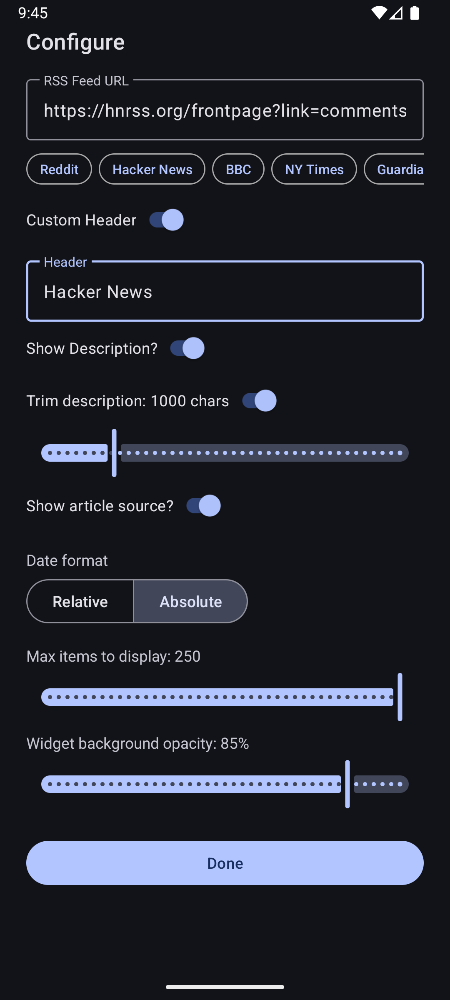
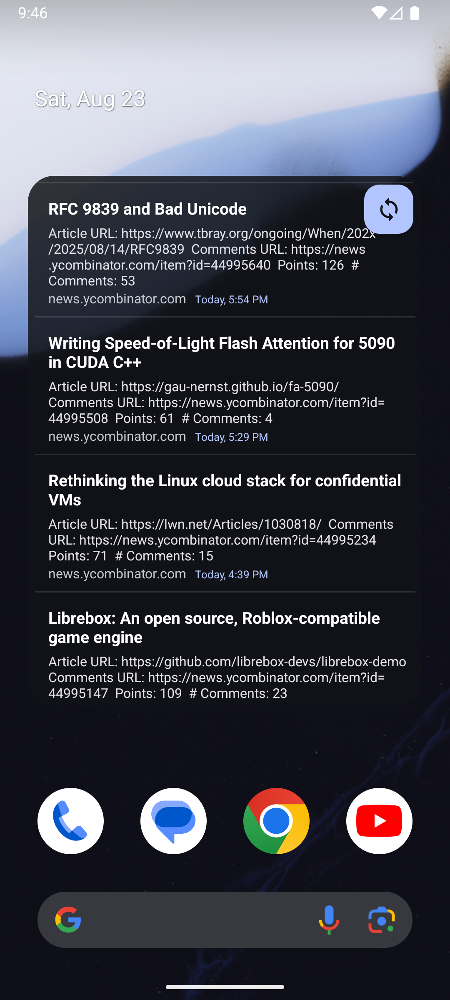
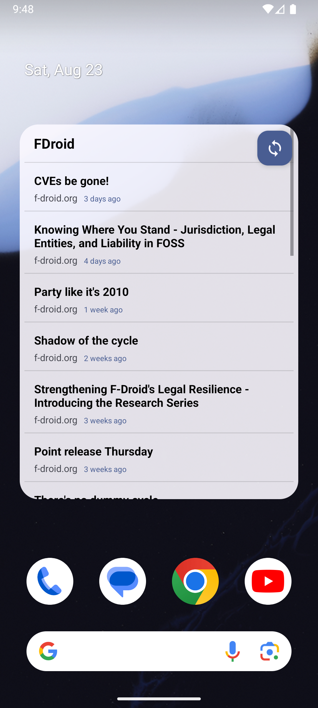

<p align="center">

</p>

<h1 align="center"><b>📱 HomeFeed - RSS Widget</b></h1>
<h4 align="center">A customizable RSS feed widget</h3>
<p align="center">

<div align="center" style="display: flex; justify-content: center; align-items: flex-start; gap: 12px; flex-wrap: wrap;">
  <a href="https://f-droid.org/packages/com.byterdevs.rsswidget">
    
  </a>
  <a href="https://github.com/byter11/rss-widget/releases">
    
  </a>
</div>


## Features

- Add any RSS feed URL and display articles in a widget
- Customizable widget header/title
- Show/hide article descriptions
- Set maximum number of items to display
- Material You dynamic colors with configurable transparency

## Screenshots

|                        |                        |                        |
|------------------------|------------------------|------------------------|
|  |    |   |

## Getting Started

### Prerequisites

- Android Studio Hedgehog or newer
- Android device or emulator (API 33+)

### Building

Clone the repository and open in Android Studio:

```sh
git clone https://github.com/yourusername/rsswidget.git
cd rsswidget
```

Build and run using Android Studio or:

```sh
./gradlew assembleDebug
```

## Dependencies

- AndroidX Core, AppCompat
- Material Components
- [Rome](https://rometools.github.io/rome/) (RSS parsing)
- [PrettyTime](https://www.ocpsoft.org/prettytime/) (date formatting)

## License

This project is licensed under the [Apache License 2.0](LICENSE).

## Acknowledgements

- [Rome](https://rometools.github.io/rome/)
- [PrettyTime](https://www.ocpsoft.org/prettytime/)
- AndroidX, Material Components
